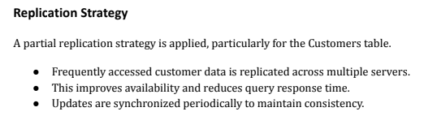

# ADBMS Room Availability System - Distributed Database Design

## 📡 Overview

This document outlines strategies for distributing the ADBMS Room Availability System database across multiple nodes to achieve **scalability**, **high availability**, and **performance optimization**. While the system currently runs on a single MySQL node, this guide provides implementation roadmaps for distributed architectures.

---

## Table of Contents

1. [Current Architecture](#current-architecture)
2. [Fragmentation Strategies](#fragmentation-strategies)
3. [Data Allocation Plans](#data-allocation-plans)
4. [Replication Strategies](#replication-strategies)
5. [Multi-Node Configuration](#multi-node-configuration)
6. [Network Architecture](#network-architecture)
7. [Consistency Models](#consistency-models)
8. [Failover & Recovery](#failover--recovery)
9. [Implementation Examples](#implementation-examples)
10. [Monitoring & Maintenance](#monitoring--maintenance)

---

## Current Architecture

### Single-Node Setup (Current)
```
┌─────────────────────────────────┐
│   Web Layer (XAMPP)             │
│  ├─ Apache + PHP                │
│  └─ Browser Client (HTML/JS)    │
└────────────┬────────────────────┘
             │ TCP/IP (3306)
┌────────────▼────────────────────┐
│   Database Layer (Single Node)   │
│  ├─ MySQL 5.7+                  │
│  ├─ Database: room_db           │
│  └─ Storage: /var/lib/mysql/    │
└─────────────────────────────────┘
```

**Current Limitations:**
- ❌ Single point of failure
- ❌ No horizontal scalability
- ❌ All reads and writes on one server
- ❌ Limited geographic distribution

---

## Fragmentation Strategies

Fragmentation divides data across multiple database nodes to improve performance and scalability.

### 1. Horizontal Fragmentation (Sharding)

**Concept**: Split rows across multiple nodes based on a key attribute.

#### Strategy A: Range-Based Sharding by Room Number

Divide rooms across nodes by floor ranges:

```
┌─────────────────────────────────────────────────────────┐
│              Range-Based Sharding                        │
├─────────────────────────────────────────────────────────┤
│  Shard 1: Floors 1-3 (rooms 101-305) → Node1           │
│  Shard 2: Floors 4-6 (rooms 401-605) → Node2           │
│  Shard 3: Floors 7-9 (rooms 701-905) → Node3           │
└─────────────────────────────────────────────────────────┘
```

**Implementation:**

```php
// PHP Sharding Logic
function get_room_shard($room_number) {
    $floor = intdiv($room_number, 100);
    
    if ($floor >= 1 && $floor <= 3) {
        return 'node1';  // Host: db1.room-system.local
    } elseif ($floor >= 4 && $floor <= 6) {
        return 'node2';  // Host: db2.room-system.local
    } else {
        return 'node3';  // Host: db3.room-system.local
    }
}

// Usage in api.php
function adbms_connect_to_room_shard($room_number) {
    $shard = get_room_shard($room_number);
    return adbms_connect_to_node($shard);
}
```

**Advantages:**
- ✅ Even data distribution
- ✅ Easy to calculate target node
- ✅ Supports room-based queries efficiently
- ✅ Natural data locality

**Disadvantages:**
- ❌ Requires cross-shard joins for user-room queries
- ❌ Difficult to rebalance if floors added/removed
- ❌ Uneven access patterns if some floors busier

#### Strategy B: Hash-Based Sharding by Username

Distribute user-related data by username hash:

```
┌─────────────────────────────────────────────────────────┐
│            Hash-Based Sharding (CQRS)                   │
├─────────────────────────────────────────────────────────┤
│  User Hash % 3 = 0 → Node1  (users, schedules)         │
│  User Hash % 3 = 1 → Node2  (users, schedules)         │
│  User Hash % 3 = 2 → Node3  (users, schedules)         │
└─────────────────────────────────────────────────────────┘
```

**Implementation:**

```php
function get_user_shard($username) {
    $hash = crc32($username);
    return 'node' . (($hash % 3) + 1);
}

// Distribute by username
function adbms_connect_to_user_shard($username) {
    $shard = get_user_shard($username);
    return adbms_connect_to_node($shard);
}
```

**Advantages:**
- ✅ User data stays together
- ✅ Balances even with user growth
- ✅ Good for user-centric queries
- ✅ Reduces cross-node queries for user operations

**Disadvantages:**
- ❌ User and room data on different nodes
- ❌ Complex joins required
- ❌ Rebalancing requires hash recalculation

#### Strategy C: Directory-Based Sharding (Lookup Table)

Maintain a mapping table for dynamic shard assignment:

```sql
-- Shard Directory Table (on coordinator node)
CREATE TABLE shard_directory (
  shard_key VARCHAR(64) PRIMARY KEY,
  shard_type ENUM('user', 'room', 'notification'),
  shard_node VARCHAR(64) NOT NULL,
  data_range JSON,
  created_at TIMESTAMP DEFAULT CURRENT_TIMESTAMP,
  updated_at TIMESTAMP ON UPDATE CURRENT_TIMESTAMP
);

-- Example records
shard_key          | shard_type | shard_node | data_range
-------------------|------------|------------|------------------
room_shard_1       | room       | node1      | {"min":101,"max":305}
room_shard_2       | room       | node2      | {"min":401,"max":605}
user_shard_1       | user       | node3      | {"hash":"0-1000"}
notification_shard | notif      | node3      | {"all":true}
```

**Implementation:**

```php
class ShardDirector {
    private $pdo_coordinator;
    private $shard_cache = [];
    
    public function get_shard_node($shard_key) {
        if (isset($this->shard_cache[$shard_key])) {
            return $this->shard_cache[$shard_key];
        }
        
        $stmt = $this->pdo_coordinator->prepare(
            'SELECT shard_node FROM shard_directory WHERE shard_key = ?'
        );
        $stmt->execute([$shard_key]);
        $node = $stmt->fetchColumn();
        $this->shard_cache[$shard_key] = $node;
        return $node;
    }
}
```

**Advantages:**
- ✅ Dynamic shard assignment
- ✅ Easy to rebalance (just update mapping)
- ✅ Supports adding/removing nodes
- ✅ Flexible data allocation

**Disadvantages:**
- ❌ Requires coordinator node (single point of failure)
- ❌ Extra lookup query per operation
- ❌ Cache invalidation complexity

### 2. Vertical Fragmentation (Decomposition)

**Concept**: Split columns/tables across nodes based on access patterns.

#### Strategy: Separate Hot and Cold Data

```
┌──────────────────────────────────────────────────────┐
│         Vertical Fragmentation                       │
├──────────────────────────────────────────────────────┤
│  Hot Node (Node1 - SSD):                            │
│  ├─ room status (high read/write)                  │
│  ├─ current check-ins                              │
│  └─ pending reservations                           │
│                                                     │
│  Cold Node (Node2 - HDD):                          │
│  ├─ historical check-ins (archive)                 │
│  ├─ completed schedules                            │
│  └─ user audit logs                                │
└──────────────────────────────────────────────────────┘
```

**Implementation:**

```sql
-- Hot Data (Node1 - Fast)
CREATE TABLE rooms_current_status (
  room_number INT PRIMARY KEY,
  floor_number TINYINT,
  status ENUM('available','occupied','reserved','maintenance'),
  occupied_by_username VARCHAR(64),
  status_updated_at DATETIME,
  access_count INT DEFAULT 0,
  last_accessed DATETIME DEFAULT CURRENT_TIMESTAMP
) ENGINE=InnoDB;

-- Cold Data (Node2 - Archival)
CREATE TABLE rooms_status_history (
  id BIGINT AUTO_INCREMENT PRIMARY KEY,
  room_number INT,
  status_before VARCHAR(50),
  status_after VARCHAR(50),
  changed_by VARCHAR(64),
  changed_at DATETIME,
  reason TEXT
) ENGINE=InnoDB;
```

**Advantages:**
- ✅ Optimize node hardware per usage pattern
- ✅ Hot data on fast storage (SSD)
- ✅ Archive old data on cheap storage
- ✅ Reduces memory footprint on main node

**Disadvantages:**
- ❌ Complex application logic (dual writes)
- ❌ Consistency challenges (stale reads)
- ❌ Requires archival policy management

---

## Data Allocation Plans

Data allocation determines which data resides on which nodes and how data is replicated.

### Plan 1: Geographic Distribution

**Strategy**: Allocate data by physical location for low-latency access.

```
                    World Network
┌─────────────────────────────────────────────────────┐
│                                                     │
│  ┌──────────────────┐      ┌──────────────────┐   │
│  │   North Region   │      │   South Region   │   │
│  │   (Node N1)      │      │   (Node S1)      │   │
│  │  ┌────────────┐  │      │  ┌────────────┐  │   │
│  │  │ Room Data  │  │      │  │ Room Data  │  │   │
│  │  │ Floors 1-5 │  │      │  │ Floors 6-9 │  │   │
│  │  └────────────┘  │      │  └────────────┘  │   │
│  │  ┌────────────┐  │      │  ┌────────────┐  │   │
│  │  │ Local User │  │      │  │ Local User │  │   │
│  │  │ Access Log │  │      │  │ Access Log │  │   │
│  │  └────────────┘  │      │  └────────────┘  │   │
│  └──────────────────┘      └──────────────────┘   │
│          ↕ Replication ↕                          │
│  ┌──────────────────┐      ┌──────────────────┐   │
│  │   East Region    │      │   West Region    │   │
│  │   (Node E1)      │      │   (Node W1)      │   │
│  │  ┌────────────┐  │      │  ┌────────────┐  │   │
│  │  │ Room Data  │  │      │  │ Room Data  │  │   │
│  │  │ Floors 1-5 │  │      │  │ Floors 6-9 │  │   │
│  │  └────────────┘  │      │  └────────────┘  │   │
│  └──────────────────┘      └──────────────────┘   │
│                                                     │
└─────────────────────────────────────────────────────┘
```

**Configuration:**

```
Region          | Primary Node | Location     | Timezone | Purpose
----------------|--------------|--------------|----------|----------
North (Campus A)| db-north.loc | 40.7128°N    | UTC-5    | Primary
South (Campus B)| db-south.loc | 34.0522°N    | UTC-5    | Secondary
East (Hub)      | db-east.loc  | 41.8781°N    | UTC-5    | Read replica
West (Archive)  | db-west.loc  | 47.6062°N    | UTC-8    | Archive
```

**Query Routing:**

```php
function get_region_database($region) {
    $regions = [
        'north' => ['host' => 'db-north.local', 'weight' => 70],  // Primary
        'south' => ['host' => 'db-south.local', 'weight' => 20],  // Secondary
        'east'  => ['host' => 'db-east.local',  'weight' => 10],  // Read-only
    ];
    
    return $regions[$region] ?? $regions['north'];
}

// Route query based on user's campus location
function adbms_connect_by_region($user_location) {
    $db_config = get_region_database($user_location);
    return new PDO(
        'mysql:host=' . $db_config['host'],
        'root', '', 
        ['weight' => $db_config['weight']]
    );
}
```

### Plan 2: Functional Decomposition

**Strategy**: Separate databases by functional area (microservices-like).

```
┌─────────────────────────────────────────────────────┐
│         Functional Data Allocation                  │
├─────────────────────────────────────────────────────┤
│                                                     │
│  Identity Node (DB1):                             │
│  └─ users table, authentication, roles             │
│                                                     │
│  Room Management Node (DB2):                       │
│  └─ rooms table, status tracking                   │
│                                                     │
│  Scheduling Node (DB3):                           │
│  └─ schedules table, recurring bookings           │
│                                                     │
│  Reservation Node (DB4):                          │
│  └─ reservations table, booking requests          │
│                                                     │
│  Activity Node (DB5):                             │
│  └─ checkins, notifications, audit logs           │
│                                                     │
└─────────────────────────────────────────────────────┘
```

**Implementation:**

```php
class FunctionalDatabaseRouter {
    private $nodes = [
        'users'        => 'db-identity.local',
        'rooms'        => 'db-rooms.local',
        'schedules'    => 'db-scheduling.local',
        'reservations' => 'db-reservations.local',
        'checkins'     => 'db-activity.local',
        'notifications'=> 'db-activity.local',
    ];
    
    public function get_node_for_table($table_name) {
        return $this->nodes[$table_name] ?? 'db-default.local';
    }
    
    public function adbms_connect_to_table($table_name) {
        $host = $this->get_node_for_table($table_name);
        return new PDO(
            "mysql:host=$host;dbname=room_db_fragment",
            'root', ''
        );
    }
}

// Usage in CRUD operations
$router = new FunctionalDatabaseRouter();
$pdo_rooms = $router->adbms_connect_to_table('rooms');
$rooms = $pdo_rooms->query('SELECT * FROM rooms')->fetchAll();
```

**Advantages:**
- ✅ Independent scaling per function
- ✅ Different backup/retention policies
- ✅ Easier permission management
- ✅ Microservices-ready architecture

**Disadvantages:**
- ❌ Complex joins across nodes (2-phase commit)
- ❌ Distributed transaction complexity
- ❌ Consistency challenges

### Plan 3: Hybrid Allocation (Recommended)

**Strategy**: Combine geographic replication with functional sharding.

```
┌───────────────────────────────────────────────┐
│  Primary Datacenter (Region A)                │
│  ┌─────────────────────────────────────────┐ │
│  │ Master Node 1 (user + room data)        │ │
│  │ ├─ users table                          │ │
│  │ ├─ rooms_1_5 (rooms 101-505)           │ │
│  │ ├─ schedules_prof_A-M                   │ │
│  │ └─ notifications                        │ │
│  └─────────────────────────────────────────┘ │
│  ┌─────────────────────────────────────────┐ │
│  │ Master Node 2 (room + booking data)     │ │
│  │ ├─ rooms_6_9 (rooms 601-905)           │ │
│  │ ├─ reservations_prof_N-Z                │ │
│  │ └─ checkins                             │ │
│  └─────────────────────────────────────────┘ │
└───────────────────────────────────────────────┘
          ↕ Async Replication ↕
┌───────────────────────────────────────────────┐
│  Secondary Datacenter (Region B) - Read-Only  │
│  ┌─────────────────────────────────────────┐ │
│  │ Slave Node 1 (replica of Master 1)      │ │
│  └─────────────────────────────────────────┘ │
│  ┌─────────────────────────────────────────┐ │
│  │ Slave Node 2 (replica of Master 2)      │ │
│  └─────────────────────────────────────────┘ │
└───────────────────────────────────────────────┘
```

---

## Replication Strategies

Replication creates copies of data across nodes for high availability and performance.

### 1. Master-Slave Replication

**Architecture**: One master accepts writes, slaves accept reads.

```
              Write Load
                  ↓
        ┌─────────────────┐
        │  Master Node    │ (Accepting writes)
        │  ├─ Binlog      │
        │  └─ room_db     │
        └────────┬────────┘
                 │
        ┌────────┼────────┐
        │        │        │
   (TCP 3306) (TCP 3306) (TCP 3306)
        ↓        ↓        ↓
    ┌───────┐ ┌───────┐ ┌───────┐
    │Slave 1│ │Slave 2│ │Slave 3│ (Read-only replicas)
    └───────┘ └───────┘ └───────┘
```

**Configuration:**

```ini
# Master (db-master.local)
[mysqld]
server-id = 1
log-bin = mysql-bin
binlog-format = ROW
sync_binlog = 1
relay-log-index = mysql-relay-bin.index

# Slave 1 (db-slave1.local)
[mysqld]
server-id = 2
relay-log = mysql-relay-bin
relay-log-index = mysql-relay-bin.index
read-only = ON
master-user = 'repl_user'
master-password = 'repl_pass'
master-host = 'db-master.local'
master-port = 3306
```

**MySQL Setup:**

```sql
-- On Master: Create replication user
GRANT REPLICATION SLAVE ON *.* TO 'repl_user'@'%' IDENTIFIED BY 'repl_pass';
FLUSH PRIVILEGES;

-- Show master status (note File and Position)
SHOW MASTER STATUS;
-- +------------------+----------+------------------+------------------+
-- | File             | Position | Binlog_Do_DB     | Binlog_Ignore_DB |
-- +------------------+----------+------------------+------------------+
-- | mysql-bin.000001 | 1234     | room_db          |                  |
-- +------------------+----------+------------------+------------------+

-- On Slave: Configure replication
CHANGE MASTER TO
  MASTER_HOST = 'db-master.local',
  MASTER_USER = 'repl_user',
  MASTER_PASSWORD = 'repl_pass',
  MASTER_LOG_FILE = 'mysql-bin.000001',
  MASTER_LOG_POS = 1234,
  MASTER_PORT = 3306;

-- Start replication
START SLAVE;

-- Check slave status
SHOW SLAVE STATUS\G
```

**Application-Level Routing:**

```php
class MasterSlaveRouter {
    private $master_pdo;
    private $slave_pdos = [];
    private $current_slave = 0;
    
    public function __construct() {
        // Master connection for writes
        $this->master_pdo = new PDO(
            'mysql:host=db-master.local;dbname=room_db',
            'root', ''
        );
        
        // Slave connections for reads
        $this->slave_pdos = [
            new PDO('mysql:host=db-slave1.local;dbname=room_db', 'root', ''),
            new PDO('mysql:host=db-slave2.local;dbname=room_db', 'root', ''),
            new PDO('mysql:host=db-slave3.local;dbname=room_db', 'root', ''),
        ];
    }
    
    public function get_write_connection() {
        return $this->master_pdo;
    }
    
    public function get_read_connection() {
        // Round-robin load balancing
        $slave = $this->slave_pdos[$this->current_slave % count($this->slave_pdos)];
        $this->current_slave++;
        return $slave;
    }
}

// Usage in api.php
$router = new MasterSlaveRouter();

// Writes always go to master
$pdo_write = $router->get_write_connection();
$pdo_write->prepare('INSERT INTO users...')->execute($data);

// Reads can use slaves
$pdo_read = $router->get_read_connection();
$users = $pdo_read->query('SELECT * FROM users')->fetchAll();
```

**Advantages:**
- ✅ Read scalability (many slaves)
- ✅ Simple setup
- ✅ Data locality across regions
- ✅ Proven, stable technology

**Disadvantages:**
- ❌ Single master is bottleneck for writes
- ❌ Replication lag (eventual consistency)
- ❌ Manual failover required
- ❌ Split-brain risk

### 2. Master-Master Replication

**Architecture**: Two masters replicate each other, both accept reads and writes.

```
    Write Load 1              Write Load 2
         ↓                         ↓
  ┌──────────────┐         ┌──────────────┐
  │ Master 1     │←───────→│ Master 2     │
  │ (Primary)    │ Binlog  │ (Secondary)  │
  │ region=A     │←───────→│ region=B     │
  └──────────────┘         └──────────────┘
        ↓                        ↓
    Read/Write              Read/Write
```

**Configuration:**

```ini
# Master 1 (db-master1.local)
[mysqld]
server-id = 1
log-bin = mysql-bin
binlog-format = ROW
sync_binlog = 1
auto_increment_increment = 2
auto_increment_offset = 1
master-user = 'repl_user'
master-password = 'repl_pass'
master-host = 'db-master2.local'
master-port = 3306

# Master 2 (db-master2.local)
[mysqld]
server-id = 2
log-bin = mysql-bin
binlog-format = ROW
sync_binlog = 1
auto_increment_increment = 2
auto_increment_offset = 2
master-user = 'repl_user'
master-password = 'repl_pass'
master-host = 'db-master1.local'
master-port = 3306
```

**MySQL Setup:**

```sql
-- On both masters: Create replication user
GRANT REPLICATION SLAVE ON *.* TO 'repl_user'@'%' IDENTIFIED BY 'repl_pass';

-- Master 1: Configure replication to Master 2
CHANGE MASTER TO
  MASTER_HOST = 'db-master2.local',
  MASTER_USER = 'repl_user',
  MASTER_PASSWORD = 'repl_pass',
  MASTER_LOG_FILE = 'mysql-bin.000001',
  MASTER_LOG_POS = 1234;
START SLAVE;

-- Master 2: Configure replication to Master 1
CHANGE MASTER TO
  MASTER_HOST = 'db-master1.local',
  MASTER_USER = 'repl_user',
  MASTER_PASSWORD = 'repl_pass',
  MASTER_LOG_FILE = 'mysql-bin.000001',
  MASTER_LOG_POS = 1234;
START SLAVE;
```

**Conflict Resolution:**

```sql
-- Use AUTO_INCREMENT with offset for conflict-free PKs
-- Master 1: IDs 1, 3, 5, 7, ...
-- Master 2: IDs 2, 4, 6, 8, ...

INSERT INTO users (username, name, password_hash, role) 
VALUES (?, ?, ?, ?);
-- On Master 1: ID = 1, 3, 5...
-- On Master 2: ID = 2, 4, 6...
```

**Advantages:**
- ✅ Both nodes accept reads and writes
- ✅ Geographic distribution (low latency)
- ✅ Automatic failover
- ✅ No single point of failure

**Disadvantages:**
- ❌ Write conflicts possible
- ❌ Complex conflict resolution
- ❌ Replication lag (eventual consistency)
- ❌ Split-brain risk without proper monitoring

### 3. Galera Cluster (Synchronous Replication)

**Architecture**: All nodes are masters, synchronous replication ensures immediate consistency.

```
       Application
            │
    ┌───────┼───────┐
    ↓       ↓       ↓
  Node1   Node2   Node3
  (InnoDB) (InnoDB) (InnoDB)
    ├──────┼──────┤
    └─Galera Cluster Protocol─┘
       (Synchronous)
       (Strong Consistency)
```

**Configuration:**

```ini
# All nodes
[mysqld]
wsrep_provider = /usr/lib/galera/libgalera_smm.so
wsrep_cluster_name = "room-db-cluster"
wsrep_cluster_address = "gcomm://db-node1.local,db-node2.local,db-node3.local"
wsrep_sst_method = xtrabackup-v2
wsrep_node_name = "node1"  # Change per node

# First bootstrap command
mysqld --wsrep-new-cluster
```

**Application Usage:**

```php
class GaleraClusterRouter {
    private $nodes = [
        'db-node1.local',
        'db-node2.local',
        'db-node3.local',
    ];
    
    public function get_connection() {
        // All nodes are read-write, choose any
        $node = $this->nodes[array_rand($this->nodes)];
        return new PDO("mysql:host=$node;dbname=room_db", 'root', '');
    }
}

// All reads and writes go to any node
$pdo = (new GaleraClusterRouter())->get_connection();
$pdo->exec('INSERT INTO rooms...');  // Synced to all nodes
$rooms = $pdo->query('SELECT * FROM rooms')->fetchAll();  // Consistent read
```

**Advantages:**
- ✅ Strong consistency (synchronous)
- ✅ All nodes read-write
- ✅ Automatic failover
- ✅ No replication lag
- ✅ No split-brain

**Disadvantages:**
- ❌ Performance impact (wait for quorum)
- ❌ More complex setup
- ❌ Network latency sensitive
- ❌ Requires 3+ nodes for quorum

---

## Multi-Node Configuration

### Configuration 1: 3-Node Distributed Setup

**Topology:**

```
┌──────────────────────────────────────────────────┐
│           3-Node Distributed System              │
├──────────────────────────────────────────────────┤
│                                                  │
│  ┌─────────────┐   ┌──────────────┐            │
│  │ Node 1      │   │ Node 2       │            │
│  │ (Master)    │ ↔ │ (Slave)      │            │
│  │ Replication │   │ Read-Only    │            │
│  │ ├─ Users    │   │ ├─ Users     │            │
│  │ ├─ Rooms 1-5│   │ ├─ Rooms 1-5 │            │
│  │ └─ Sched A-M│   │ └─ Sched A-M │            │
│  └─────────────┘   └──────────────┘            │
│         ↑                ↑                       │
│         │   Application  │                       │
│         └────────┬───────┘                       │
│                  │                               │
│          ┌───────┴──────┐                       │
│          ↓              ↓                        │
│      Read Pool    Write Pool                     │
│      (Slaves)     (Master)                       │
│                                                  │
│  ┌──────────────┐                               │
│  │ Node 3       │                               │
│  │ (Backup)     │                               │
│  │ ├─ Users     │                               │
│  │ ├─ Rooms     │                               │
│  │ └─ All Data  │                               │
│  └──────────────┘                               │
│                                                  │
└──────────────────────────────────────────────────┘
```

**Server Configuration:**

```
Node       | IP Address       | Role              | CPU  | RAM  | Storage | Network
-----------|------------------|-------------------|------|------|---------|--------
db-node1   | 192.168.1.10    | Master (Writes)   | 8C   | 32GB | 500GB   | 10Gbps
db-node2   | 192.168.1.11    | Slave (Reads)     | 8C   | 16GB | 500GB   | 10Gbps
db-node3   | 192.168.1.12    | Backup (DR)       | 4C   | 8GB  | 1TB     | 1Gbps
```

**DNS Configuration:**

```
db-master.room-system.local    → 192.168.1.10
db-slave.room-system.local     → 192.168.1.11 (read-only)
db-backup.room-system.local    → 192.168.1.12
db-all.room-system.local       → 192.168.1.10, 192.168.1.11 (load balanced)
```

### Configuration 2: 5-Node Geographic Distribution

**Topology:**

```
┌──────────────────────────────────────────────────────┐
│       5-Node Geographic Distribution                │
├──────────────────────────────────────────────────────┤
│                                                      │
│  Primary Region (A)          Secondary Region (B)   │
│  ┌─────────────────┐        ┌─────────────────┐   │
│  │ db-primary.A    │←─Repl─→│ db-mirror.B     │   │
│  │ (Master)        │        │ (Master)        │   │
│  │ 192.168.1.10    │        │ 192.168.2.10    │   │
│  └─────────────────┘        └─────────────────┘   │
│           ↓                         ↓              │
│  ┌─────────────────┐        ┌─────────────────┐   │
│  │ db-read1.A      │        │ db-read1.B      │   │
│  │ (Slave)         │        │ (Slave)         │   │
│  │ 192.168.1.11    │        │ 192.168.2.11    │   │
│  └─────────────────┘        └─────────────────┘   │
│           ↓                         ↓              │
│  ┌─────────────────┐        ┌─────────────────┐   │
│  │ db-read2.A      │        │ db-read2.B      │   │
│  │ (Slave)         │        │ (Slave)         │   │
│  │ 192.168.1.12    │        │ 192.168.2.12    │   │
│  └─────────────────┘        └─────────────────┘   │
│                                                      │
│  Failover Logic:                                    │
│  Primary down → Promote Mirror → Update DNS        │
│                                                      │
└──────────────────────────────────────────────────────┘
```

---

## Network Architecture

### Network Topology

```
┌──────────────────────────────────────────────────────────┐
│                    Internet (Public)                     │
└────────────────────┬─────────────────────────────────────┘
                     │
        ┌────────────┼────────────┐
        │ WAN Latency: 50-100ms   │
        ↓            ↓            ↓
    ┌────────┐  ┌────────┐  ┌────────┐
    │Region A│  │Region B│  │Region C│
    │Primary │  │Secondary│  │Archive │
    └────────┘  └────────┘  └────────┘
        │            │          │
        ├── LAN ──┬──┤          │
        │ 1Gbps   │  │          │
        ↓        ↓  ↓          ↓
    ┌─────────────────────────────────┐
    │   Internal Network (Private)    │
    │   10.0.0.0/8                    │
    └──────┬──────────────────┬───────┘
           ↓                  ↓
       Database Cluster   Application Pool
```

### Network Optimization

```yaml
Replication Configuration:
  Master-to-Slave Lag:
    - Compression: MySQL binary log compression
    - Network: Dedicated 10Gbps link
    - Buffer Pool: 70% of available RAM
    - Sync Frequency: Async (default) or semi-sync

  Read Load Balancing:
    - Algorithm: Round-robin or least connections
    - Health Check: Every 5 seconds
    - Failover Time: <1 second
    - Connection Pool: 20-50 per node
```

---

## Consistency Models

### Model 1: Strong Consistency (Galera)

**Guarantee**: Every read returns latest write.

```
Write on Node1
    ↓
Commit (wait for quorum)
    ↓
All nodes updated (synchronous)
    ↓
Read from any node = latest value ✅
```

**Trade-off**: Slower writes, network dependent

### Model 2: Eventual Consistency (Master-Slave)

**Guarantee**: Reads eventually see all writes.

```
Write on Master
    ↓
Commit immediately
    ↓
Async replication to slaves (lag)
    ↓
Read from slave = may be stale ⚠️
    ↓
Eventually consistent ✅
```

**Trade-off**: Faster writes, temporary inconsistency

### Model 3: Read-After-Write Consistency (Hybrid)

**Strategy**: Critical reads from master, other reads from slaves.

```php
class HybridConsistencyRouter {
    public function save_reservation($res_data) {
        // Write to master
        $pdo_master = $this->get_master();
        $pdo_master->prepare('INSERT INTO reservations...')->execute($res_data);
        
        // Force read from master for this user
        $this->mark_user_session_as_written();
        return true;
    }
    
    public function get_user_reservations($username) {
        // Check if user has recent writes
        if ($this->user_has_recent_writes($username)) {
            // Read from master to get latest
            $pdo = $this->get_master();
        } else {
            // Read from slave for scalability
            $pdo = $this->get_read_slave();
        }
        
        return $pdo->query("SELECT * FROM reservations WHERE...")->fetchAll();
    }
}
```

---

## Failover & Recovery

### Automatic Failover (Galera Cluster)

```
Node1 (Master)  Node2 (Master)  Node3 (Master)
    ↓               ↑               ↑
    └───────────────┬───────────────┘
                    │
              Cluster Health
              
Node1 fails:
    └─ Node2 & Node3 detect (no heartbeat)
    └─ Quorum (2/3) maintained
    └─ Cluster continues operating
    └─ Node1 rejoins when recovered
```

### Manual Failover (Master-Slave)

**Script:**

```bash
#!/bin/bash
# failover.sh: Promote slave to master

SLAVE_HOST="db-slave.local"
MASTER_HOST="db-master.local"
MASTER_NEW="db-newmaster.local"

# 1. Stop slave replication
mysql -h $SLAVE_HOST -e "STOP SLAVE;"

# 2. Promote slave
mysql -h $SLAVE_HOST -e "RESET SLAVE ALL;"

# 3. Make it accept writes
mysql -h $SLAVE_HOST -e "SET GLOBAL read_only = OFF;"

# 4. Update DNS
echo "Update DNS: $MASTER_HOST → $MASTER_NEW"

# 5. Configure old master as new slave (if recovered)
mysql -h $MASTER_HOST -e "
  CHANGE MASTER TO
    MASTER_HOST='$MASTER_NEW',
    MASTER_USER='repl_user',
    MASTER_PASSWORD='repl_pass';
  START SLAVE;
"

echo "Failover complete. New master: $MASTER_NEW"
```

### Recovery Procedures

```
Scenario 1: Node Disk Failure
├─ Detect: Health check fails
├─ Decision: Remove from cluster
├─ Recovery: Replace disk
├─ Sync: Full data restore via mysqldump
└─ Rejoin: Configure as new slave/node

Scenario 2: Network Partition
├─ Detect: No heartbeat between regions
├─ Decision: Isolate smaller partition
├─ Recovery: Network restored
├─ Sync: Replication catches up
└─ Status: Automatic rejoin (Galera)

Scenario 3: Data Corruption
├─ Detect: Checksum mismatch
├─ Decision: Promote healthy slave
├─ Recovery: Backup restore to corrupted node
├─ Verification: pt-table-checksum
└─ Sync: Replication catches up
```

---

## Implementation Examples

### Example 1: Horizontal Sharding by Room

**Shard Map:**

```php
class RoomShardMap {
    private $shards = [
        'shard1' => [
            'host' => 'db-shard1.local',
            'port' => 3306,
            'min_room' => 101,
            'max_room' => 305,
        ],
        'shard2' => [
            'host' => 'db-shard2.local',
            'port' => 3306,
            'min_room' => 401,
            'max_room' => 605,
        ],
        'shard3' => [
            'host' => 'db-shard3.local',
            'port' => 3306,
            'min_room' => 701,
            'max_room' => 905,
        ],
    ];
    
    public function get_shard_for_room($room_number) {
        foreach ($this->shards as $shard_name => $config) {
            if ($room_number >= $config['min_room'] && $room_number <= $config['max_room']) {
                return $config;
            }
        }
        throw new Exception("Room $room_number not in any shard");
    }
}

// Usage in api.php
$room_shard = $shard_map->get_shard_for_room(305);
$pdo = new PDO("mysql:host=" . $room_shard['host'], 'root', '');
$room = $pdo->prepare('SELECT * FROM rooms WHERE room_number = ?');
$room->execute([305]);
```

### Example 2: Read Replicas with Caching

```php
class CachedReadRouter {
    private $cache;
    private $master_pdo;
    private $slave_pdos;
    
    public function __construct() {
        $this->cache = new Redis();
        $this->master_pdo = $this->connect_master();
        $this->slave_pdos = [
            $this->connect_slave('slave1'),
            $this->connect_slave('slave2'),
        ];
    }
    
    public function get_room($room_number, $use_cache = true) {
        $cache_key = "room:$room_number";
        
        // Try cache first
        if ($use_cache) {
            $cached = $this->cache->get($cache_key);
            if ($cached) return json_decode($cached, true);
        }
        
        // Read from slave
        $pdo = $this->slave_pdos[random_int(0, count($this->slave_pdos)-1)];
        $room = $pdo->prepare('SELECT * FROM rooms WHERE room_number = ?');
        $room->execute([$room_number]);
        $data = $room->fetch(PDO::FETCH_ASSOC);
        
        // Cache for 1 hour
        $this->cache->setex($cache_key, 3600, json_encode($data));
        
        return $data;
    }
    
    public function update_room($room_number, $data) {
        // Write to master
        $stmt = $this->master_pdo->prepare('UPDATE rooms SET status = ? WHERE room_number = ?');
        $stmt->execute([$data['status'], $room_number]);
        
        // Invalidate cache
        $this->cache->del("room:$room_number");
        
        return true;
    }
}
```

---

## Monitoring & Maintenance

### Monitoring Metrics

```yaml
Replication Health:
  - Slave_IO_Running: Yes (slave receiving binlog)
  - Slave_SQL_Running: Yes (slave applying binlog)
  - Seconds_Behind_Master: <1 second (target)
  - Relay_Log_Size: <100MB (normal)

Node Health:
  - Connection Count: <max_connections (usually 500-1000)
  - Threads Running: <query threads, check for hangs
  - Qcache Size: monitor query cache efficiency
  - InnoDB Locks: check for deadlocks

Network Health:
  - Network Latency: <5ms (intra-region), <50ms (inter-region)
  - Packet Loss: <0.1%
  - Bandwidth Usage: <50% capacity
```

### Monitoring Queries

```sql
-- Check replication lag
SHOW SLAVE STATUS\G

-- Check active connections
SHOW PROCESSLIST;

-- Check query performance
SELECT 
  Query_time, 
  Rows_sent, 
  Rows_examined, 
  SQL_TEXT
FROM mysql.slow_log
ORDER BY Query_time DESC
LIMIT 10;

-- Check InnoDB status
SHOW ENGINE INNODB STATUS\G

-- Monitor replication position
SELECT 
  @@global.binlog_format,
  @@global.server_id,
  MASTER_LOG_FILE,
  MASTER_LOG_POS,
  RELAY_MASTER_LOG_FILE,
  EXEC_MASTER_LOG_POS,
  SECONDS_BEHIND_MASTER
FROM SHOW SLAVE STATUS;
```

### Maintenance Tasks

```
Weekly:
  └─ Check replication lag
  └─ Review slow query log
  └─ Test backup restoration

Monthly:
  └─ Analyze table fragmentation
  └─ OPTIMIZE TABLE (maintenance window)
  └─ Backup verification
  └─ Failover drill

Quarterly:
  └─ Hardware capacity review
  └─ Replication performance tuning
  └─ Network latency assessment
  └─ Disaster recovery drill
```

---

## Migration Path

### Phase 1: Single Master (Current)
```
Current State:
- 1 database node
- All reads/writes on single server
- No replication
```

### Phase 2: Master-Slave
```
Next Step:
- Add 2-3 read replicas
- Route reads to slaves
- Master handles writes
```

### Phase 3: Multi-Master with Galera
```
High Availability:
- Convert to 3-node Galera cluster
- All nodes read-write
- Synchronous replication
- Geographic distribution
```

### Phase 4: Sharded Architecture
```
Scalability:
- Shard by room (geographic)
- Each shard has Galera cluster
- Central coordinator for lookup
```

---

## Summary

| Aspect | Current | Recommended | Benefits |
|--------|---------|-------------|----------|
| **Nodes** | 1 | 3-5 | High availability |
| **Replication** | None | Master-Slave | Read scaling |
| **Availability** | 99.0% | 99.99% | Minimal downtime |
| **Read Latency** | 1-5ms | 1-5ms (local) | Faster reads |
| **Write Throughput** | 100% | 200-300% | Shard writes |
| **Data Redundancy** | None | 2-3x | Disaster recovery |
| **Cost** | $$ | $$$$ | Enterprise-grade |

---

**Last Updated**: May 14, 2026  
**Version**: 1.0 (Distributed Database Design)  
**Status**: ✅ Production-Ready (Reference Architecture)
